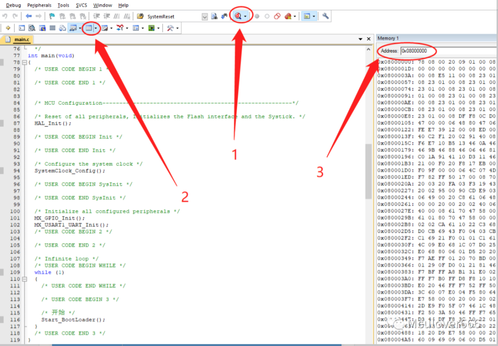
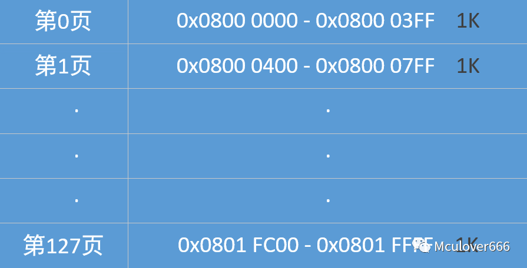
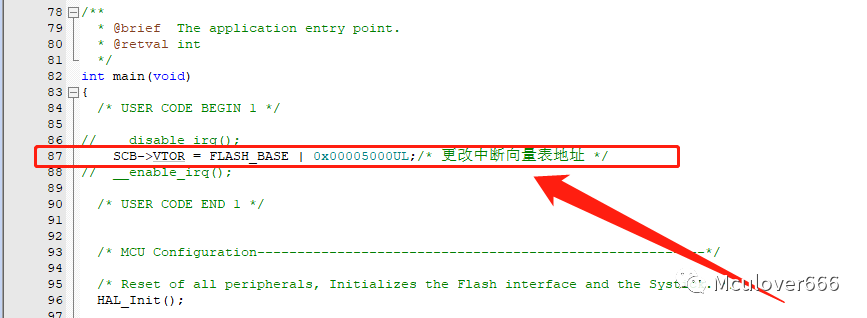
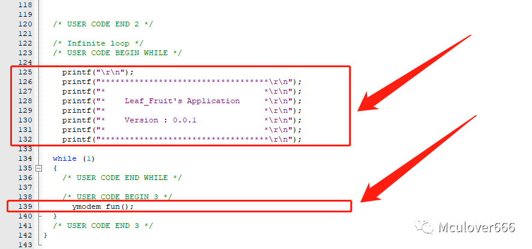
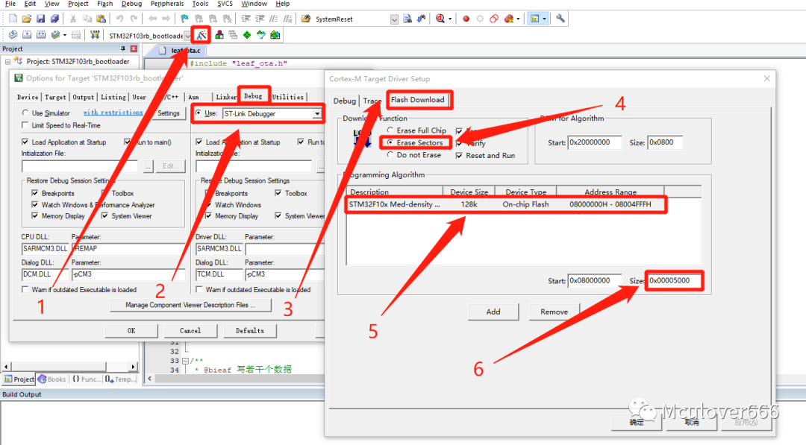
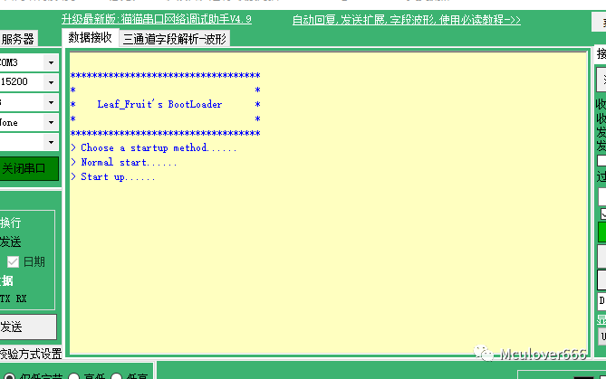
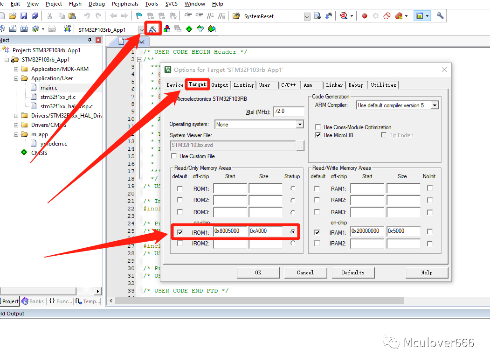

# **简介**

本文主要讲解在线升级(OTA)的基础知识, 主要是针对`IAP OTA`从`原理分析`, `分区划分`, 到`代码编写`和`实验验证`等过程阐述这一过程. 帮助大家加深对OTA的认识.

# **1. OTA基础知识**

### **什么是BootLoader?**

`BootLoader`可以理解成是引导程序, 它的作用是启动正式的`App应用程序`. 换言之, `BootLoader`是一个程序, App也是一个程序,  `BootLoader程序`是用于启动`App程序`的.

### **STM32中的程序在哪儿?**

正常情况下, 我们写的程序都是放在STM32片内Flash中(暂不考虑外扩Flash). 我们写的代码最终会变成二进制文件, 放进Flash中 感兴趣的话可以在`Keil`>>>`Debug`>>>`Memory`中查看, 右边Memory窗口存储的就是代码



接下来就可以进入正题了.

### **进行分区**

既然我们写的程序都会变成二进制文件存放到Flash中, 那么我们就可以进一步对我们程序进行分区. 我使用的是`F103RB-NUCLEO开发板`,他的Flash一共128页, 每页1K.见下图:



以它为例, 我将它分为三个区.`BootLoader区`、 `App1区`、 `App2区(备份区)`具体划分如下图:

- `BootLoader区`存放启动代码
- `App1区`存放应用代码
- `App2区`存放暂存的升级代码


### **总体流程图**

- 先执行`BootLoader`程序, 先去检查`APP2`区有没有程序, 如果有就将App2区(备份区)的程序拷贝到`App1区`, 然后再跳转去执行`App1`的程序.
- 然后执行`App1`程序, 因为`BootLoader`和`App1`这两个程序的向量表不一样, 所以跳转到`App1`之后第一步是先去更改程序的向量表. 然后再去执行其他的应用程序.
- 在应用程序里面会加入程序升级的部分, 这部分主要工作是拿到升级程序, 然后将他们放到`App2区(备份区)`, 以便下次启动的时候通过`BootLoader`更新`App1`的程序. 流程图如下图所示:


# **2. BootLoader的编写**

本节主要讲解在线升级(OTA)的`BooLoader`的编写，我将以我例程的BootLoader为例, 讲解`BootLoader`(文末会提供免费的代码下载链接)，其他的大体上原理都差不多。

### **流程图分析**

以我例程的BootLoader为例：

我将`App2区`的最后一个字节(`0x0801FFFC`)用来表示`App2区`是否有升级程序, STM32在擦除之后Flash的数据存放的都是`0xFFFFFFFF`, 如果有, 我们将这个地址存放`0xAAAAAAAA`. 具体的流程图见下图所示


### **程序编写和分析**

所需STM32的资源有:

- 发送USART数据和printf重定向
- Flash的读写
- 程序跳转指令,可以参考如下代码:

```javascript
/* 采用汇编设置栈的值 */
__asm void MSR_MSP (uint32_t ulAddr)
{
    MSR MSP, r0   //设置Main Stack的值
    BX r14
}


/* 程序跳转函数 */
typedef void (*Jump_Fun)(void);
void IAP_ExecuteApp (uint32_t App_Addr)
{
  Jump_Fun JumpToApp;

  if ( ( ( * ( __IO uint32_t * ) App_Addr ) & 0x2FFE0000 ) == 0x20000000 )  //检查栈顶地址是否合法.
  {
    JumpToApp = (Jump_Fun) * ( __IO uint32_t *)(App_Addr + 4);  //用户代码区第二个字为程序开始地址(复位地址)
    MSR_MSP( * ( __IO uint32_t * ) App_Addr );                  //初始化APP堆栈指针(用户代码区的第一个字用于存放栈顶地址)
    JumpToApp();                                                //跳转到APP.
  }
}
```

- 在需要跳转的地方执行这个函数就可以了`IAP_ExecuteApp(Application_1_Addr);`
- 其他的代码请参考`BootLoader`源代码

# **3. APP的编写**

本节主要讲解在线升级(OTA)的`App1`的编写以及整个流程的说明，我将以我例程的App为例, 采用Ymodem协议进行串口传输,讲解`App`的编写(后面会提供免费的代码下载链接), 其他的协议原理大体上都差不多, 都是通过某种协议拿到升级的代码。

### **流程图分析**

以我例程的App1为例：

- 先修改向量表, 因为本程序是由BootLoader跳转过来的, 不修改向量表后面会出现问题；
- 打印版本信息, 方便查看不同的App版本；
- 本例程的升级程序采用串口的Ymoderm协议进行传输bin文件. 具体的流程图见下图所示：


### **程序编写和分析**

所需STM32的资源有:

- 发送USART数据和printf重定向
- Flash的读写
- 串口的DMA收发
- YModem协议相关

### **Ymodem协议**

- 百度百科[Ymodem协议]
- 具体流程可自行查找相关文档, 这儿提供一个我找到的 XYmodem.pdf(文末和源码一起提供).
- Ymodem协议相关介绍可参考我的这篇教程 YModem介绍

(https://blog.csdn.net/weixin_41294615/article/details/104652105).

### **代码分析**

- 代码大多数都是通过串口实现Ymodem协议的接收, 这儿就不详细说明
- 后面放了我的源代码, 详情请参考我的源代码.
- 主函数添加修改向量表的指令



- 打印版本信息以及跳转指令



- YModem相关的文件接收部分

```javascript
/**
 * @bieaf YModem升级
 *
 * @param none
 * @return none
 */
void ymodem_fun(void)
{
	int i;
	if(Get_state()==TO_START)
	{
		send_command(CCC);
		HAL_Delay(1000);
	}
	if(Rx_Flag)    	// Receive flag
	{
		Rx_Flag=0;	// clean flag
				
		/* 拷贝 */
		temp_len = Rx_Len;
		for(i = 0; i < temp_len; i++)
		{
			temp_buf[i] = Rx_Buf[i];
		}
		
		switch(temp_buf[0])
		{
			case SOH:///<数据包开始
			{
				static unsigned char data_state = 0;
				static unsigned int app2_size = 0;
				if(Check_CRC(temp_buf, temp_len)==1)///< 通过CRC16校验
				{					
					if((Get_state()==TO_START)&&(temp_buf[1] == 0x00)&&(temp_buf[2] == (unsigned char)(~temp_buf[1])))///< 开始
					{
						printf("> Receive start...\r\n");

						Set_state(TO_RECEIVE_DATA);
						data_state = 0x01;						
						send_command(ACK);
						send_command(CCC);

						/* 擦除App2 */							
						Erase_page(Application_2_Addr, 40);
					}
					else if((Get_state()==TO_RECEIVE_END)&&(temp_buf[1] == 0x00)&&(temp_buf[2] == (unsigned char)(~temp_buf[1])))///< 结束
					{
						printf("> Receive end...\r\n");

						Set_Update_Down();						
						Set_state(TO_START);
						send_command(ACK);
						HAL_NVIC_SystemReset();
					}					
					else if((Get_state()==TO_RECEIVE_DATA)&&(temp_buf[1] == data_state)&&(temp_buf[2] == (unsigned char)(~temp_buf[1])))///< 接收数据
					{
						printf("> Receive data bag:%d byte\r\n",data_state * 128);
						
						/* 烧录程序 */
						WriteFlash((Application_2_Addr + (data_state-1) * 128), (uint32_t *)(&temp_buf[3]), 32);
						data_state++;
						
						send_command(ACK);		
					}
				}
				else
				{
					printf("> Notpass crc\r\n");
				}
				
			}break;
			case EOT://数据包开始
			{
				if(Get_state()==TO_RECEIVE_DATA)
				{
					printf("> Receive EOT1...\r\n");
					
					Set_state(TO_RECEIVE_EOT2);					
					send_command(NACK);
				}
				else if(Get_state()==TO_RECEIVE_EOT2)
				{
					printf("> Receive EOT2...\r\n");
					
					Set_state(TO_RECEIVE_END);					
					send_command(ACK);
					send_command(CCC);
				}
				else
				{
					printf("> Receive EOT, But error...\r\n");
				}
			}break;	
		}
	}
}
```

- 其中部分函数未在以上代码中展现, 详情请参看文末给出的源码链接.

# **4. 整体测试**

本节主要对前三节的教程做测试验证 `BootLoader` + `App`的升级功能。

### **源代码**

BootLoader源代码和App1源代码可以在原作者的gitee获取：

https://gitee.com/leafguo/leaf_notes/STM32CubeMX/STM32CubeMx_OTA

### **代码的下载**

- 由下图可知两份代码的下载区域是不一样的，所以他们**「下载的区域也不一样」**。


### **BootLoader的下载**

- BootLoader的代码默认是最开始的所以不需要特别设置代码的下载位置
- 按照下图, 修改擦除方式为`Erase Sectors`, 大小限制在`0X5000`(20K)



- 烧录代码
- 运行, 通过串口1打印输出, 会看到以下打印消息
- 说明BootLoader已经成功运行



### **App1的下载**

- App1稍微复杂一点, 需要将代码的起始位置设置为`0x08005000`
- 同时也要修改擦除方式为`Erase Sectors`, 见下图




- 烧录代码
- 运行, 通过串口1打印输出, 会看到以下打印消息
- 说明`BootLoader`已经成功跳转到版本号为0.0.1的`App1`


### **生成App2的.bin文件**

- Keil如何生成.bin文件, 请参考这篇博文 Keil如何生成.bin文件

https://blog.csdn.net/weixin_41294615/article/details/104656577

- 修改代码, 把版本号改为0.0.2, 并且编译并且生成.bin文件
- 生成好之后你会得到一个.bin结尾的文件, 这就是我们待会儿YModem要传输的文件


### **使用Xshell进行文件传输**

- 打开Xshell
- 代码中, 串口1进行调试信息的打印, 串口2进行YModem升级的
- 所以使用Xshell打开串口2进行文件传输, 串口1则可以通过串口调试助手查看调试消息
- 你会看到App的版本成功升级到0.0.2了.
- 如果你到了这一步.
- 那么恭喜你! 你已经能够使用在线升级了!

# **5. 总结**

通过本几节的教程, 想必你已经会使用在线升级了, 只要原理知道了其他的问题都可以迎刃而解了, 除了使用YModem协议传输.bin文件, 你还可以通过蓝牙, WIFI,等其他协议传输, 只要能够将.bin文件传输过去, 那其他的部分原理都差不多.