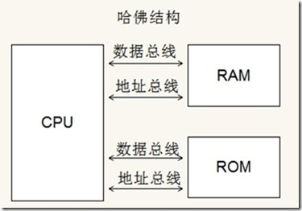
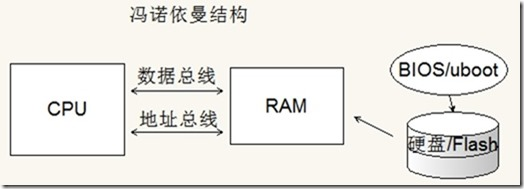
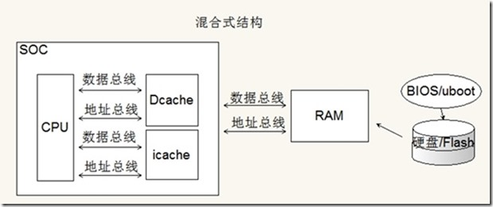

## CPU 和指令数据的关系

    CPU的核心是运算器和控制器，CPU就好像一个数据加工机器，你给他原材料数据，他按照机器指令的指示帮你做加工（加法减法，左移等），再将加工后的数据返回给你。所以CPU需要与外界建立优质的数据通道，而这2种结构就是CPU和外界存储器建立数据通道的2种不同思路。
    
    大家注意CPU和外界对接的数据一共有2组。一组是指令，也就是机器码，也就是你写的软件代码被编译器转化成的二进制指令。另一组是数据，也就是软件中的变量，譬如放在全局数据区的全局变量，放在stack中的局部变量等，都是数据。
    
    指令和数据加起来构成了整个程序，指令是指导CPU如何加工数据的，所以你可以简单理解为数据是原材料，指令是加工流程说明。CPU工作时要不断同时吞吐指令和数据，所以这2项内容（本质其实都是数据，指令也是二进制数据的形式）必须都有途径能和CPU进行交换。

## 什么是哈佛结构和冯诺依曼结构

    这2种结构其实就是CPU如何同时获取指令和数据的2种不同设计思路。
    
    哈佛结构认为CPU应该分别通过2组独立的总线来对接指令和数据，而冯诺依曼结构认为CPU通过1组总线来分时获取指令和数据即可。
    
    举个栗子形象说明下。你把CPU想象成一个蒸馒头的厨房，蒸馒头需要面粉和水，那你怎么送面粉和水进去呢？哈佛结构认为这个厨房应该开2个门，一个专门送面粉，一个专门送水。这样面粉和水可以通过2条路走2个门同时送给厨房。
    
    这样做的好处是显而易见的。首先速度就快啊，因为面粉和水可以同时送，不必耽搁。其次，不容易搞错，面粉走面粉的门而水走水的门，怎么搞错？而且还安全啊，譬如送水的把水桶打翻了就不会影响到面粉，是吧？有坏处吗？当然有了（这个世界上只有好处没有坏处的事儿很少...）。你开2个门修2条路得花双份的成本啊，是门不要钱还是路不要钱啊？其实这个也不算坏处，叫成本更合适。记住，考虑任何事的好坏评价时，一定要考虑各自的成本。不考虑成本就评价好坏纯属耍流氓。
    
    冯诺依曼结构就觉得开一个门修一条路就够了，分时复用嘛。譬如运送一次面粉或者水都需要1秒钟，那就这一秒送面粉，下一秒送水。然后下一秒再送面粉，下一秒再送水。这样做的好处当然就是省成本了。坏处呢？显然意见，一个是效率低，一个是容易弄混弄错嘛。
    
    所以这2种结构其实分别对应的是高成本高效率高可靠性，和低成本低效率低可靠度这2种不同思路。很好区分。

## 两种结构哪种好

    没有绝对的好坏。
    
    MCU也就是单片机中几乎都是用哈佛结构，譬如广泛使用的51单片机、典型的STM32单片机（核心是ARM Cortex-M系列的）都是哈佛结构。为什么MCU要使用哈佛结构呢？我个人认为有几个原因。
    
    一个是哈佛结构更加稳定安全，MCU 使用的坏境对稳定性和安全性要求都比较高，所以使用哈佛结构更有保障。另一个是速度会更快一些，因为传统的 MCU 主频都很低所以速度不高，使用哈佛结构多少能提高一些系统性能。还有一个考量就是 MCU 的指令和数据需求量都不大，配置不高，所以内存往往使用 SRAM 而不使用 DRAM，这样就导致他更适合哈佛结构。如果 MCU 用冯诺依曼结构反而不好设计。当然这些都是我自己的理解，做不得准，我毕竟不是做 CPU 设计工作的，而只是使用 CPU 做产品这一段的，理解难免不到位，各位带着批判的眼光看即可。
    
    PC 和服务器芯片（譬如 Intel AMD 那些出的），ARMCortex-A 系列嵌入式芯片（譬如核心是 ARM CortexA8 的三星 S5PV210，譬如华为的麒麟 970 等手机芯片）等都是冯诺依曼结构。这些系统都需要大量内存，所以工作内存都是 DRAM，因为他们更适合使用冯诺依曼系统。

## 混合和纯粹结构

    这2种结构的定义都是很纯粹的，修2个门2条路，和修1个门1条路肯定是大不相同的。但是实际上CPU内部的设计远比给厨房修门和路要复杂的多。
    
    譬如说寄存器和Cache，这2个就是在CPU和存储器之间做中转的，所以考虑了这2个之后你发现CPU和存储器并不直接相连，这就增加了复杂性了。
    
    所以实际上存在这2种结构混用的情况，而且现代的CPU（准确说叫SoC）基本都不是纯粹的哈佛结构或冯诺依曼机构，而都是混合结构的。
    
    譬如说咱们嵌入式linux核心课程中讲到的三星S5PV210吧，这家伙使用ARM的Cortex-A8核心，按道理应该是冯诺依曼结构吧。实际上确实是这样，咱们使用的X210/Study210开发板上配备了512MB的DDR SDRAM，和8GB的EMMC。正常工作时所有的程序和数据都从EMMC中加载到DDR中，也就是说不管你是指令还是数据，存储都是在EMMC中，运行时都在DDR中，再通过cache和寄存器送给CPU去加工处理。这就是典型的冯诺依曼系统嘛。
    
    但是，S5PV210内部仍然有一定容量的irom和96kb的iram，这些irom和iram是用于SoC引导和启动的，大家学习过我们嵌入式linux核心课程的ARM裸机部分就知道，芯片上电后首先会执行内部irom中固化的代码，其实执行这些代码时210就好像一个MCU一样，irom就是他的flash，iram就是他的SRAM，这又是典型的哈佛结构。
    
    这就是混合式结构设计，而非纯粹设计。
    
    为什么要混合式设计？很简单，为了各取所长而已。

## arm 到底用的什么结构

    有一些ARM（Cortex-M系列）是哈佛结构，而另一些ARM（Cortex-A）是冯诺依曼结构（或者更准确说是混合结构）。
